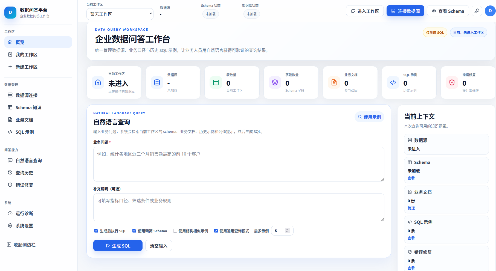

<div align="center">


# DataPilot

### 企业级 Text-to-SQL 数据问答平台

DataPilot 是一个面向 SQLite / MySQL 数据库的自然语言问数系统。  
系统结合 Schema 知识、业务文档、SQL 示例、错误修复记忆、Schema 图裁剪和结构相似召回，帮助用户将自然语言问题转换为可执行、可验证、可持续优化的 SQL 查询。

<br/>


</div>

---

## 项目预览

<div align="center">



</div>

---

## 项目简介

**DataPilot** 不是一个简单的 SQL 生成工具，而是一个面向企业数据库场景的 **Text-to-SQL 工作台**。

系统支持连接 SQLite 或 MySQL 数据库，自动读取数据库结构，进行 Schema Profiling，生成增强 Schema，并允许用户持续导入业务文档、字段注释、Question-SQL 示例和错误修复经验。

通过工作区持久化机制，DataPilot 可以为每个数据库保存独立知识，不需要每次连接数据库都重新分析和训练，从而形成可持续积累、可持续纠错、可持续增强的数据库问答系统。

---

## 核心能力

| 能力 | 说明 |
|---|---|
| 多数据库接入 | 支持 SQLite / MySQL 数据库连接，自动读取表、字段、主键、外键等 Schema 信息 |
| Workspace 持久化 | 每个数据库拥有独立工作区，保存 Schema、Profile、注释、文档、SQL 示例和错误修复记忆 |
| Schema Profiling | 自动采样字段值、统计空值比例、提取字段特征，为注释生成和 SQL 生成提供依据 |
| 增强 Schema | 融合 Raw Schema、Profile、自动注释和人工注释，生成更适合 Text-to-SQL 的 Schema 表达 |
| 人工知识覆盖 | 支持导入手写 Schema、SQL COMMENT、普通文本或 JSON 格式注释，人工注释优先于自动注释 |
| Schema 图建模 | 将表、字段、外键和潜在关系建模为 Schema Graph，用于关系推理和 Schema 裁剪 |
| 值域重叠关系 | 基于字段样例值和 MinHash / Jaccard 相似度发现潜在跨表关联，补充缺失外键关系 |
| 图裁剪与拓扑寻路 | 根据用户问题激活相关表/字段，并通过图搜索生成更小、更相关的 Schema 上下文 |
| Column Value Hints | 根据问题、字段样例值和 Profile 信息生成列值提示，帮助模型选择正确过滤字段和值 |
| 业务文档记忆 | 保存指标定义、业务规则、默认过滤条件、同义词和领域知识 |
| SQL 示例记忆 | 保存用户确认正确的 Question-SQL 示例，后续相似问题可复用高质量样例 |
| 错误修复记忆 | 保存错误 SQL、错误原因和修复建议，帮助后续生成时避免重复错误 |
| GNN 结构召回 | 支持基于 SQL 结构相似度召回示例，不只依赖自然语言相似度 |
| 反馈闭环 | 支持生成 SQL、执行 SQL、保存正确示例、记录错误修复，形成持续优化闭环 |

---

## 系统架构

```text
React Frontend
    ↓
FastAPI Backend
    ↓
Text-to-SQL Agent
    ↓
Workspace Memory
    ├── Schema Knowledge
    ├── Business Documentation
    ├── Question-SQL Examples
    └── Error-Fix Memory
    ↓
SQLite / MySQL
```

---

## 项目结构

```text
DataPilot/
├── agent/              Text-to-SQL Agent 主流程
├── api/                FastAPI 后端接口
├── connectors/         SQLite / MySQL 数据库连接器
├── core/               核心业务逻辑
├── frontend/           React 前端页面
├── memory/             记忆存储模块
├── retrieval/          示例召回模块
├── schema/             Schema 解析与注释处理
├── schema_graph/       Schema 图构建与裁剪
├── services/           LLM 调用与 Prompt 服务
├── utils/              通用工具函数
├── workspace/          工作区管理
├── config.py           项目配置
├── run_api.py          后端启动入口
├── requirements.txt    Python 依赖
└── README.md
```

---

## 快速启动

### 1. 克隆项目

```bash
git clone https://github.com/huangliuliu666/DataPilot.git
cd DataPilot
```

### 2. 启动后端

```bash
pip install -r requirements.txt

export MODELSCOPE_API_KEY="your_modelscope_api_key"
export OLLAMA_TIMEOUT=180

python run_api.py
```

### 3. 启动前端

```bash
cd frontend

npm install

npm run dev
```

---

## 工作区设计

DataPilot 会为每个数据库建立独立工作区。

```text
data/workspaces/{db_id}/
├── schema/
│   ├── raw_schema.json
│   ├── table_profile.json
│   ├── auto_annotations.json
│   ├── manual_annotations.json
│   └── enriched_schema.sql
└── memory/
    ├── documentation_memory.json
    ├── question_sql_memory.json
    └── error_fix_memory.json
```

---

## 支持的数据库

| 数据库 | 状态 |
|---|---|
| SQLite | 支持 |
| MySQL | 支持 |

---

## 项目状态

本项目仍在持续开发中。当前版本重点支持本地部署、数据库连接、Schema 知识管理、业务文档沉淀、自然语言生成 SQL、SQL 执行和基于记忆的持续优化。

---

<div align="center">


</div>
